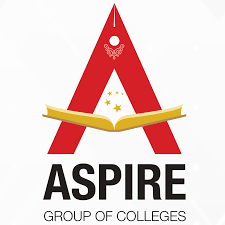
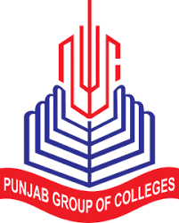
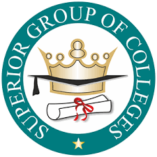
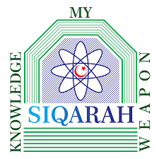

## Portfolio

---

### Aspire Group Of Colleges (2021)
 I worked as Head of Department(URDU) and Management Committe of Aspire Group of Colleges. I start working here in 2021. Here I have to handle the Urdu Department as well as Management of College

---

### Punjab Group Of Colleges (2018-20)
  I worked as Head of Department(URDU) in Punjab Group of Colleges. Here I got the best Teacher Award in 2019. Also got the Appreciation award in 2020. The percentage 
of my Department was 85% in Board Examination.I also handle the Discipline Comitte here.

----
### Superior Group Of Colleges (2013-18)
  I worked as Head of Department(URDU) in Superior Group of Colleges. Here I got the best Teacher Award in 2014. Also got the Appreciation award in 2015 and 2016. The percentage of my Department was 82% in Board Examination.I also worked as a Examination Controller here.

-----

### Saqara School and Academy (2010-13)
  I started my career of teaching here as a Urdu teacher. I spend my four years here as a Teacher. Here I also worked as a vice principle .In here ,I controll all management systems of that School.

